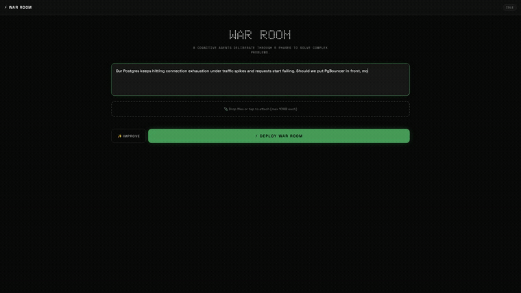

# ⚔️ War Room

> *Eight minds. Five phases. One answer.*



**War Room** is a multi-agent AI deliberation engine. A council of 8 core agents analyzes a complex problem, from an architecture decision to a strategic pivot. Each agent has its own role, method, and area of expertise. Up to 3 domain specialists can join the council for one session. Together they run a structured 5-phase deliberation and produce one synthesized recommendation.

**Contents:** [How it works](#how-it-works) · [The Council](#the-council) · [Architecture](#architecture) · [Local quick start](#local-quick-start) · [Deploy with Docker](#deploy-with-docker) · [Configuration](#configuration) · [Auth gate](#auth-gate) · [Model routing](#model-routing) · [HTTP API](#http-api) · [WebSocket](#websocket) · [MCP server](#mcp-server) · [Operations](#operations) · [Tests](#tests) · [Project structure](#project-structure)

---

## How it works

```
Problem Statement
       │
       ▼
┌─────────────────────────────────────────────────────────────┐
│  Phase 1: Problem Framing                                   │
│  🎯 Process Architect · 🔍 Research Scout · 🔗 Synthesizer  │
│  → Define scope, gather context, map the terrain            │
└─────────────────────────────────────────────────────────────┘
       │
       ▼
┌─────────────────────────────────────────────────────────────┐
│  Phase 2: Divergence                                        │
│  💡 Divergent Generator · 🔗 Synthesizer                    │
│  📐 Quantitative Expert · 📜 Qualitative Expert             │
│  + up to 3 domain specialists                               │
│  → Generate solutions without judgment                      │
└─────────────────────────────────────────────────────────────┘
       │
       ▼
┌─────────────────────────────────────────────────────────────┐
│  Phase 3: Convergence                                       │
│  ⚖️ Convergent Evaluator · 📐 Quantitative Expert           │
│  📜 Qualitative Expert · 🔍 Research Scout                  │
│  + up to 3 domain specialists                               │
│  → Evaluate, rank, and narrow the field                     │
└─────────────────────────────────────────────────────────────┘
       │
       ▼
┌─────────────────────────────────────────────────────────────┐
│  Phase 4: Red Team                                          │
│  🔴 Red Teamer · ⚖️ Convergent Evaluator · 🎯 Process Arch  │
│  → Attack every assumption. Find every failure mode.        │
└─────────────────────────────────────────────────────────────┘
       │
       ▼
┌─────────────────────────────────────────────────────────────┐
│  Phase 5: Synthesis                                         │
│  🎯 Process Architect                                       │
│  → Final recommendation with full reasoning chain           │
└─────────────────────────────────────────────────────────────┘
```

Each agent of a phase takes one turn, and then the next phase starts. No API call advances a phase. A blocking escalation pauses the room. The room continues when a human answers, or when the timeout applies the default that the agent stated (see [Operations](#operations)).

---

## The Council

| Agent | Role | Hat | Purpose |
|-------|------|-----|---------|
| 🎯 **Process Architect** | Metacognitive Conductor | Blue Hat | Orchestrates the deliberation, ensures rigor, produces final synthesis |
| 🔗 **Systems Synthesizer** | Boundary Spanner | Cross-Domain | Connects ideas across disciplines, spots emergent patterns |
| 💡 **Divergent Generator** | Creative Disruptor | Green Hat | Generates unconventional ideas without judgment |
| ⚖️ **Convergent Evaluator** | Analytical Engine | Black/White Hat | Rigorously evaluates and ranks proposals |
| 🔴 **Red Teamer** | Adversarial Stress-Tester | Devil's Advocate | Attacks every assumption, finds failure modes |
| 📐 **Quantitative Expert** | Technical Depth | STEM | Provides data, math, and empirical grounding |
| 📜 **Qualitative Expert** | Institutional Depth | Policy/Business | Brings human, organizational, and strategic context |
| 🔍 **Research Scout** | Information Architect | Intel | Gathers live intelligence via web search |

**Specialists.** Up to 3 domain specialists can join a session in addition to the core 8. A [role preset](#role-presets) picks its specialists first. Then the fingerprint classifier adds specialists when its confidence is 0.7 or more. Specialists speak in Divergence and Convergence only. The migrations seed 11 templates:

Data Scientist, Education Designer, Financial Strategist, Infrastructure Architect, Legal Analyst, Medical Advisor, ML Engineer, Policy Analyst, Research Methodologist, Security Engineer, UX Strategist.

---

## Architecture

```
┌──────────────────────────────────────────────────────────┐
│                     War Room server                      │
│                Node.js 22 + Express + ws                 │
├──────────────────────────────────────────────────────────┤
│  Web UI (public/) · REST /api/* · WebSocket · MCP /mcp   │
├──────────────────────────────────────────────────────────┤
│  SQLite (WAL) + sqlite-vec                               │
│  sessions · messages · escalations · settings · jobs     │
├──────────────────────────────────────────────────────────┤
│  LLM routes (per agent)                                  │
│  default · anthropic-api · openai-api · openrouter       │
│  subscription · ollama-local                             │
├──────────────────────────────────────────────────────────┤
│  Optional services                                       │
│  Search: Tavily, or SearXNG + DuckDuckGo                 │
│  Embedding endpoint: memory and semantic search          │
│  files-service: uploads and file context                 │
└──────────────────────────────────────────────────────────┘
```

**Stack:** Node.js 22 · Express · WebSocket (`ws`) · SQLite (`better-sqlite3`, `sqlite-vec`) · MCP SDK · zod · pino · Docker

At each start, the server applies new SQL migrations from `migrations/`. The database file is `data/warroom.db`, unless `WAR_ROOM_DB_PATH` names another file.

---

## Local quick start

You need Node.js 22 (the version of the Docker image and CI) and npm. `npm ci` downloads a prebuilt `better-sqlite3` binary. When no prebuilt binary matches your platform, it compiles one with python3, make, and a C++ compiler.

1. Get the code and install the dependencies.

```bash
git clone https://github.com/phj6688/warroom.git
cd warroom
npm ci
```

2. Create a `.env` file with a random token for the [auth gate](#auth-gate). If `.env` exists, the command replaces it.

```bash
echo "WAR_ROOM_TOKEN=$(openssl rand -hex 32)" > .env
```

3. Add one LLM backend to `.env`, for example the line `ANTHROPIC_API_KEY=<your key>`. [Model routing](#model-routing) lists the other backends. Without a backend, the server starts, but every agent turn fails.

4. Start the server. Node reads `.env` only because of the `--env-file` flag.

```bash
node --env-file=.env server.js
```

The server listens on port 8090 on all network interfaces. Set `PORT` to use another port. No variable changes the bind address.

5. Check the server from a second terminal in the same directory.

```bash
curl -s localhost:8090/health
curl -s -o /dev/null -w '%{http_code}\n' localhost:8090/api/agents
curl -s -H "Authorization: Bearer $(sed -n 's/^WAR_ROOM_TOKEN=//p' .env)" localhost:8090/api/agents
```

The first command returns JSON with `"auth":"enforced"`. The second command prints `401`. The third command returns the 8 core agents.

**Web UI.** The browser cannot send the token yet. To use the UI on your own machine, start an open instance. First, stop the server from step 4. An empty `WAR_ROOM_TOKEN` in the shell overrides the value in `.env`.

> **Warning:** An open instance gives full read and write access to every host that can reach its port. That includes settings changes, session deletes, and LLM calls on your keys. Use an open instance only on a trusted network, or behind a host firewall.

```bash
WAR_ROOM_TOKEN= WAR_ROOM_ALLOW_ANONYMOUS=true node --env-file=.env server.js
```

Then open http://localhost:8090.

---

## Deploy with Docker

The `Dockerfile` and `docker-compose.yml` target a self-hosted stack: Infisical holds the secrets, and Traefik routes requests to the container. Outside that stack, the container does not start. On any other host, use the [local quick start](#local-quick-start).

| The container needs | Reason | Result without it |
|---|---|---|
| An Infisical project id and a machine identity (universal auth) | `docker/entrypoint.sh` logs in to Infisical and starts the server under `infisical run`, which injects the secrets as environment variables. | Compose or the entrypoint refuses to start. |
| An Infisical server that the container reaches as `infisical:8080` | Compose sets `INFISICAL_DOMAIN=http://infisical:8080` under `environment:`, so `.env` cannot change it. | The Infisical login fails, and the entrypoint exits. |
| `WAR_ROOM_TOKEN` in the environment of the container | The image sets `NODE_ENV=production`, so the server refuses `WAR_ROOM_ALLOW_ANONYMOUS`. | The server exits with code 78, and `restart: unless-stopped` starts it again in a loop. |
| The Docker network `platform-net` | Compose declares it as an external network. | Compose does not start the service. |
| A `.env` file | Compose reads it through `env_file`, and for `${INFISICAL_PROJECT_ID}`. | Compose does not start the service. |

Compose also does these things:

- It publishes port 8090 on `127.0.0.1` only. Traefik reaches the container over `platform-net`.
- It mounts `./data` for the database and `./uploads` (legacy, unused).
- Its Traefik labels route the host in `WARROOM_HOST` through the `forwardauth-zitadel@file` middleware. Without that Traefik setup, the labels have no effect.

To deploy:

1. Create the network once with `docker network create platform-net`.
2. Write the machine identity to `secrets/infisical_client_id` and `secrets/infisical_client_secret`.
3. Add `INFISICAL_PROJECT_ID=<project id>` to `.env`.
4. Store `WAR_ROOM_TOKEN`, `MCP_API_KEY`, and your LLM keys in the Infisical project, in the `prod` environment. Compose sets `INFISICAL_ENV=prod`.
5. Build the image with the commit in it, and start the container.

```bash
BUILD_SHA=$(git rev-parse HEAD) docker compose up -d --build
```

The sha lives in the image, so a later plain `docker compose up -d` keeps it. The served page then carries `<meta name="x-build-sha">`.

6. Check the deploy.

```bash
WARROOM_URL=http://127.0.0.1:8090 WARROOM_PUBLIC_URL=https://<your public host> ./verify.sh
```

`verify.sh` checks `/health` and `/metrics`, and it checks that `/api/files-service-config` returns no token field. It also expects 302, 401, or 403 from the public URL. It exits non-zero on any failure.

---

## Configuration

The server reads its startup configuration from environment variables. `node server.js` does not read `.env` by itself: use `node --env-file=.env server.js`, or export the variables. Docker Compose reads `.env` through `env_file`, and the container entrypoint adds the Infisical secrets. Per-agent routing and cost settings live in the database (see [Model routing](#model-routing) and [Billing and cost](#billing-and-cost)).

### Auth

| Variable | Required | Default | Effect |
|---|---|---|---|
| `WAR_ROOM_TOKEN` | Yes, unless the anonymous opt-in applies | unset | Bearer token for every `/api/*` route and the WebSocket upgrade. `mcp/stdio.mjs` also sends it. |
| `WAR_ROOM_ALLOW_ANONYMOUS` | No | `false` | `true` (case-insensitive) starts an open instance when no token is set. Use it only on a trusted network. See [Auth gate](#auth-gate). |
| `MCP_API_KEY` | For `/mcp` | random per start | Key for the `/mcp` HTTP transport, separate from `WAR_ROOM_TOKEN`. |
| `NODE_ENV` | No | unset (the image sets `production`) | `production` makes the server refuse the anonymous opt-in. |

### LLM routing

| Variable | Required | Default | Effect |
|---|---|---|---|
| `MODEL` | No | `claude-opus-5` | Default model. [Model routing](#model-routing) shows which settings take priority. |
| `ANTHROPIC_API_KEY` | One LLM backend | unset | Key for the Anthropic API. It serves the `anthropic-api` route, and the default route when `OPENAI_API_KEY` is unset. |
| `OPENAI_API_KEY` | One LLM backend | unset | Bearer for the OpenAI-compatible endpoint in `OPENAI_BASE_URL`. When set, that endpoint is the default route. |
| `OPENAI_BASE_URL` | No | `https://api.openai.com/v1` | Endpoint of the default route. Any other host counts as a subscription gateway (see [Billing and cost](#billing-and-cost)). |
| `OPENAI_PLATFORM_API_KEY` | No | unset | Key for the `openai-api` route. Without it, that route uses `OPENAI_API_KEY` only when `OPENAI_BASE_URL` is the OpenAI API. |
| `OPENROUTER_API_KEY` | No | unset | Key for the `openrouter` route. |
| `OPENROUTER_BASE_URL` | No | `https://openrouter.ai/api/v1` | Endpoint of the `openrouter` route. |
| `CLIPROXY_GATEWAY_URL` | No | unset | Endpoint of the `subscription` route. It needs `CLIPROXY_GATEWAY_TOKEN`. |
| `CLIPROXY_GATEWAY_TOKEN` | No | unset | Bearer for the `subscription` route. |
| `OLLAMA_BASE_URL` | No | `http://localhost:11434/v1` | Endpoint of the `ollama-local` route. |
| `OLLAMA_API_KEY` | No | `ollama` | Bearer for the `ollama-local` route. |
| `QUALITY_MODEL` | No | unset (`MODEL` applies) | Model for the fingerprint classifier, memory analyzer, adversarial twin, and quality evaluator. |
| `AGENT_MODEL_<agentId>` | No | unset | Model for one agent, for example `AGENT_MODEL_red-teamer`. Each agent id contains a hyphen. `node --env-file` passes such names. The container entrypoint is a `/bin/sh` script, and it drops such names when they come from compose or `.env`. In the container, use a [per-agent override](#per-agent-overrides). |

### Limits and timeouts

| Variable | Required | Default | Effect |
|---|---|---|---|
| `AGENT_MAX_TOKENS` | No | uncapped | Output cap for agent turns. Only a positive integer sets a cap. An uncapped OpenAI-compatible call sends no `max_tokens`. |
| `SYNTHESIS_MAX_TOKENS` | No | uncapped | Output cap for the final synthesis turn. |
| `ANTHROPIC_MAX_TOKENS` | No | `64000` | `max_tokens` for an uncapped call to the Anthropic API, which requires the field. |
| `LLM_TIMEOUT_MS` | No | `600000` | Deadline for one LLM call. |
| `MAX_CONSECUTIVE_TURN_FAILURES` | No | `4` | Failed agent turns in a row before the server abandons a run. |
| `ESCALATION_TIMEOUT_MS` | No | `300000` | Wait for an answer to a blocking escalation before its default applies. |

### Search

| Variable | Required | Default | Effect |
|---|---|---|---|
| `SEARCH_PROVIDER` | No | `tavily` | `tavily`, `smart` (SearXNG and DuckDuckGo, no key), or `coexist` (`smart` first, then Tavily when `smart` fails or finds nothing). |
| `TAVILY_API_KEY` | No | unset | Tavily key. With `tavily` and no key, the agents run without live search. |
| `SEARXNG_URL` | No | `http://host.docker.internal:9090` | SearXNG endpoint for `smart` and `coexist`. Set it for a local run. |
| `SEARCH_MAX_RESULTS` | No | `5` | Results per query. |
| `SCOUT_USE_TOOL` | No | `false` | `true`: the Research Scout searches through a `web_search` tool call. `false`: it writes `SEARCH:` lines, and the server runs those queries. |
| `AGENT_SEARCH_EXPANSION` | No | `false` | `true` also gives `web_search` to the Red Teamer, the Quantitative Expert, and 5 specialists (legal, medical, financial, security, policy). |
| `SESSION_QUERY_BUDGET` | No | `30` | Maximum `web_search` queries in one session. |

### Embeddings and memory

| Variable | Required | Default | Effect |
|---|---|---|---|
| `EMBED_GATEWAY_URL` | No | `http://embed-gateway:8200` | OpenAI-style embeddings endpoint (`POST /v1/embeddings`). Memory recall and semantic search use it. When it fails, memory recall and the REST semantic search return no results. Over `/mcp`, `warroom_semantic_search` returns an error. |
| `EMBED_MODEL` | No | `nomic-embed-text` | Embedding model name. |
| `EMBEDDING_DIM` | No | `768` | Expected vector length. The vector table has 768 dimensions. |
| `EMBEDDING_TIMEOUT_MS` | No | `10000` | Deadline for one embedding call. |

### files-service

| Variable | Required | Default | Effect |
|---|---|---|---|
| `FILES_SERVICE_URL` | No | unset | Endpoint of files-service, a separate service for upload, extraction, and retrieval. |
| `FILES_SERVICE_TOKEN` | No | unset | Bearer for files-service. The server never returns it to a client. |
| `FILE_TOKEN_BUDGET` | No | `150000` | File tokens that go inline into an agent turn. The agents get the rest of the file content through retrieval. |

File features need both `FILES_SERVICE_URL` and `FILES_SERVICE_TOKEN`. War Room runs without them. The browser uploads through `POST /api/files/upload`, and the server adds the token to the request. When both variables are set, the server checks `/healthz` on files-service at start. If files-service does not answer, the server exits with code 1.

### Storage and runtime

| Variable | Required | Default | Effect |
|---|---|---|---|
| `PORT` | No | `8090` | Port for HTTP and the WebSocket. |
| `WAR_ROOM_DB_PATH` | No | `data/warroom.db` in the repository | SQLite file. The server resolves a relative value from the working directory, and it creates the parent directory. |
| `LOG_LEVEL` | No | `info` | pino log level. The logs go to stderr as JSON. |
| `BASELINE_LOG` | No | unset | JSONL file under the working directory. It receives the token usage of each LLM call. |
| `JOB_WORKER_INTERVAL_MS` | No | `5000` | Poll interval of the background job worker. |
| `JOB_MAX_ATTEMPTS` | No | `5` | Attempts before the worker marks a background job as failed. |
| `IMPROVER_SYSTEM_PROMPT` | No | unset | System prompt for the problem improver when `prompts/meta/improver.md` is absent or empty. |
| `BUILD_SHA` | No | empty | Commit sha. A hex value adds `<meta name="x-build-sha">` to the served page. The Docker build takes it as a build argument. |

### MCP stdio transport

| Variable | Required | Default | Effect |
|---|---|---|---|
| `WAR_ROOM_URL` | No | `http://localhost:8090` | Server that `mcp/stdio.mjs` calls. The transport also reads `WAR_ROOM_TOKEN`. |

### Container only

`docker/entrypoint.sh` and `docker-compose.yml` read these variables. The server does not read them.

| Variable | Required | Default | Effect |
|---|---|---|---|
| `INFISICAL_PROJECT_ID` | Yes | unset | Infisical project that holds the secrets. |
| `INFISICAL_UNIVERSAL_AUTH_CLIENT_ID` | Yes | contents of `/run/secrets/infisical_client_id` | Client id of the machine identity. |
| `INFISICAL_UNIVERSAL_AUTH_CLIENT_SECRET` | Yes | contents of `/run/secrets/infisical_client_secret` | Client secret of the machine identity. |
| `INFISICAL_DOMAIN` | No | `http://infisical:8080` | URL of the Infisical server. Compose sets this value, so `.env` cannot change it. The entrypoint default applies only outside compose. |
| `INFISICAL_ENV` | No | `prod` | Infisical environment to read. Compose sets this value, so `.env` cannot change it. |
| `WARROOM_HOST` | No | `warroom.localhost` | Host rule of the Traefik router. |

Compose gives defaults to `SEARCH_PROVIDER`, `SEARXNG_URL`, `SCOUT_USE_TOOL`, `AGENT_SEARCH_EXPANSION`, `SESSION_QUERY_BUDGET`, `EMBED_GATEWAY_URL`, `EMBED_MODEL`, and `IMPROVER_SYSTEM_PROMPT`. It also sets `BASELINE_LOG=data/baseline-usage.jsonl`.

---

## Auth gate

`WAR_ROOM_TOKEN` gates every `/api/*` route and the WebSocket upgrade with a bearer token. Three paths are exempt. `/health` and `/metrics` stay open, so that a probe can read them. `/mcp` has its own gate, `MCP_API_KEY`, which `mcp/http.js` checks. The exemption is an exact path match, never a prefix. `/api/health` returns the same data as `/health`, but the gate covers it.

The gate accepts the token in these places:

| Target | Token |
|---|---|
| `/api/*` | `Authorization: Bearer <WAR_ROOM_TOKEN>` |
| WebSocket upgrade | `Authorization: Bearer <WAR_ROOM_TOKEN>`, the `?token=` query parameter, or the `Sec-WebSocket-Protocol` header |
| `/mcp` | `MCP_API_KEY` as the `?key=` query parameter, or `Authorization: Bearer <MCP_API_KEY>` |

> **The web UI cannot authenticate yet.** The page sends no credential: no `Authorization` header on a request, and no token on the socket. When `WAR_ROOM_TOKEN` is set, every call from the page answers 401. The page itself still loads, because static files load ahead of the gate. The page reads `/health` on load and shows a notice instead of an empty page.
>
> To drive a gated instance, use the `/mcp` HTTP transport, or a client that sends the token on HTTP and on the WebSocket. The REST API cannot stop or delete a session, send a message, or answer an escalation. Only the WebSocket and MCP can. To run the UI locally, use `WAR_ROOM_ALLOW_ANONYMOUS=true` on a trusted network.

The server **refuses to start** when `WAR_ROOM_TOKEN` is absent, empty, or whitespace, unless the anonymous opt-in applies. It exits with code `78` (`EX_CONFIG`) and writes the reason to stderr. So a deployment that loses the secret stops, and it does not serve every route and every socket to anonymous callers.

The anonymous opt-in applies only when all three conditions are true:

- `WAR_ROOM_TOKEN` is empty. A token always wins.
- `WAR_ROOM_ALLOW_ANONYMOUS` is `true` (case-insensitive).
- `NODE_ENV` is not `production`. The container image sets `NODE_ENV=production` as a default.

An open instance accepts every HTTP call and every WebSocket upgrade. The server listens on all network interfaces, and no variable changes that. Use an open instance only on a trusted network, or behind a host firewall.

The `NODE_ENV` guard is only a default. Compose `environment:`, `env_file:`, and `docker run --env` override an image `ENV`. A run that sets `WAR_ROOM_ALLOW_ANONYMOUS=true` and a different `NODE_ENV` gets an open container. That takes two deliberate variables, never the absence of one.

When `MCP_API_KEY` is unset, the server makes a random key at each start. Nobody holds that key, so `/mcp` is unreachable rather than open, and the server logs a warning at start.

Each instance reports its own posture:

```bash
curl -s localhost:8090/health | jq .auth                        # "enforced" or "anonymous"
curl -s localhost:8090/metrics | grep '^war_room_auth_enforced'  # 1 or 0
```

---

## Model routing

Each agent call goes to a **route**: a transport, an endpoint, and a credential. An agent without a stored override uses the default route.

| Route | Transport and endpoint | Credentials |
|---|---|---|
| default | OpenAI-compatible at `OPENAI_BASE_URL` when `OPENAI_API_KEY` is set, else the Anthropic API | `OPENAI_API_KEY`, or `ANTHROPIC_API_KEY` |
| `anthropic-api` | Anthropic API | `ANTHROPIC_API_KEY` |
| `openai-api` | OpenAI-compatible at `https://api.openai.com/v1` | `OPENAI_PLATFORM_API_KEY`, or `OPENAI_API_KEY` when `OPENAI_BASE_URL` is the OpenAI API |
| `openrouter` | OpenAI-compatible at `OPENROUTER_BASE_URL` | `OPENROUTER_API_KEY` |
| `subscription` | OpenAI-compatible at `CLIPROXY_GATEWAY_URL` | `CLIPROXY_GATEWAY_URL` and `CLIPROXY_GATEWAY_TOKEN`. Without them, the route uses the default endpoint when that endpoint is a gateway. |
| `ollama-local` | OpenAI-compatible at `OLLAMA_BASE_URL` | None required (`OLLAMA_API_KEY` defaults to `ollama`) |

The model of an agent comes from the first source that has a value:

1. The stored override for the agent.
2. `AGENT_MODEL_<agentId>`.
3. `QUALITY_MODEL`, for the fingerprint classifier, memory analyzer, adversarial twin, and quality evaluator.
4. `MODEL` (default `claude-opus-5`).

When a call goes out with `ANTHROPIC_API_KEY`, the server removes the prefix `anthropic/` from the model id.

### Per-agent overrides

Each of the 8 core agents and each of the 11 specialist templates can have its own route and model. Set an override in one of these places:

- The Settings panel in the web UI.
- `PUT /api/settings/agent-routing` with a body such as `{"routing": {"red-teamer": {"route": "openrouter", "model": "<model id>"}}}`. The body replaces the whole stored map, so include every override that you want to keep.
- The MCP tool `warroom_set_model`. Use `agentId: "all"` to set every agent.

The server stores overrides in the `app_settings` table and uses them at once, without a restart. They apply to the whole server, also to sessions that already run. A route other than the default needs an explicit model. A stored route without credentials falls back to the default route, and the server logs a warning.

To find a model id, use `GET /api/settings/models?route=<route>` or `warroom_list_models`. To probe one route and model with a one-token completion, use `POST /api/settings/test-connection` or `warroom_test_model`.

### Preflight dry run

The server tests a model change before it stores it. The dry run covers each agent of the 5 phases, every specialist template, and 5 support calls. The support calls are the fingerprint classifier, memory analyzer, problem improver, adversarial twin, and quality evaluator.

The dry run sends one real minimal completion for each distinct route, model, and probe kind. The `tools` probe covers agent turns, which always send a tools array. The `chat` probe covers the support calls. A route that falls back to another route counts as a failure.

- `PUT /api/settings/agent-routing` answers `409` with `"error": "preflight_failed"` and the report, and it stores nothing.
- `"force": true` stores the change after a failed dry run. `"skipPreflight": true` stores it without a dry run.
- A write that changes no route or model skips the dry run.
- `POST /api/settings/preflight` and `warroom_preflight` run the dry run and store nothing. The HTTP body can set `timeoutMs`, the deadline of each probe in milliseconds (1000 to 60000, default 15000).
- `warroom_set_model` returns a failed report as an error and stores nothing, unless `force` is true.

---

## HTTP API

Every `/api/*` route needs `Authorization: Bearer <WAR_ROOM_TOKEN>` (see [Auth gate](#auth-gate)). A JSON body can be up to 10 MB. `POST /api/files/upload` takes multipart form data. An invalid body answers `400`.

### Open routes

| Method | Path | Purpose |
|---|---|---|
| `GET` | `/health` | Status, session counts, uptime, and auth posture |
| `GET` | `/metrics` | Prometheus text: sessions, active sessions, failed deliberations, uptime, auth posture |
| `GET` `POST` `DELETE` | `/mcp` | MCP Streamable HTTP transport, gated by `MCP_API_KEY` |
| `GET` | `/`, `/index.html` | Web UI page. It carries the build sha when `BUILD_SHA` holds a hex sha. The other files in `public/` are also open. |

### Sessions

| Method | Path | Purpose |
|---|---|---|
| `GET` | `/api/sessions` | The 50 most recent sessions, with counts, outcome, tokens, and cost |
| `POST` | `/api/sessions` | Create a session and start the deliberation. Body: `problem`, optional `file_ids`, `preset_id` (`engineer` or `scientist`), `continuesFromSessionId` |
| `GET` | `/api/sessions/:id` | One session with messages, escalations, human messages, files, and outcome |
| `POST` | `/api/sessions/:id/resume` | Restart an inactive session at its first unfinished phase. `409` when the session runs, or when every phase ran |
| `PUT` | `/api/sessions/:id/pin` | Pin or unpin a session. Body: `pinned` |
| `POST` | `/api/sessions/:id/files` | Attach files-service files. Body: `file_ids` |
| `GET` | `/api/sessions/:id/agents` | The core agents plus the specialists of the session |
| `GET` | `/api/sessions/:id/decision-record` | The Synthesis verdict as JSON (see [Decision record](#decision-record)) |
| `GET` | `/api/sessions/:id/export` | Export. `?mode=` `full_transcript` (default), `end_result`, or `end_result_with_qa`. `?format=` `txt` (default), `md`, or `json` |
| `GET` | `/api/sessions/:id/export/options` | The export modes and formats available for the session |
| `GET` | `/api/sessions/:id/quality` | Quality score. `404` until the session has a score |
| `POST` | `/api/sessions/:id/quality` | Human rating. Body: `rating` (`USEFUL`, `PARTIAL`, or `MISLEADING`) |
| `GET` | `/api/sessions/:id/shadow` | The single-model shadow answer, the synthesis, and the score delta |

### Search, memory, and analytics

| Method | Path | Purpose |
|---|---|---|
| `GET` | `/api/search?q=` | Keyword search in problems and messages (20 results at most) |
| `GET` | `/api/sessions/search/semantic?q=&limit=` | Semantic search (`limit` 20 at most). `[]` when the embedding endpoint fails |
| `GET` | `/api/memory/similar?q=&limit=` | Memory from similar past sessions (`limit` 10 at most) |
| `GET` | `/api/analytics/quality` | Quality analytics across the scored sessions that have a synthesis |

### Catalog

| Method | Path | Purpose |
|---|---|---|
| `GET` | `/api/agents` | The 8 core agents |
| `GET` | `/api/phases` | The 5 phases and their agents |
| `GET` | `/api/presets` | The role presets |
| `GET` | `/api/specialists` | The active specialist templates |
| `GET` | `/api/health` | The same data as `/health`, behind the gate |

### Settings

| Method | Path | Purpose |
|---|---|---|
| `GET` | `/api/settings/agent-routing` | Routable agents, routes, route availability, stored overrides, and the effective route and model of each agent |
| `PUT` | `/api/settings/agent-routing` | Store overrides after a dry run. Body: `routing`, optional `force`, `skipPreflight`. `409` when the dry run fails |
| `POST` | `/api/settings/preflight` | Dry run on the stored or a candidate routing. Body: optional `routing`, `timeoutMs` |
| `POST` | `/api/settings/test-connection` | One-token probe. Body: `route`, `model` |
| `GET` | `/api/settings/models?route=` | Model ids that the provider of the route serves |
| `GET` | `/api/settings/cost` | Effective pricing, subscription, electricity, and billing mode of each route, plus the defaults |
| `PUT` | `/api/settings/cost` | Store any of `pricing`, `subscription`, `electricity`, `routeBilling` |

### Files and tools

| Method | Path | Purpose |
|---|---|---|
| `GET` | `/api/files-service-config` | `{"url": ...}` of files-service. `503` when files-service is not configured. It never returns the token |
| `POST` | `/api/files/upload` | Multipart upload proxy to files-service. The server adds the files-service token |
| `POST` | `/api/improve` | Rewrite a problem statement. Body: `problem`. `503` when no improver prompt exists |

---

## WebSocket

Connect to `ws://localhost:8090`. On a gated instance, send the token as the [Auth gate](#auth-gate) describes. On connect, the server sends `sessions`, `agents`, and `phases`. A client receives the events of a session only after it subscribes to that session. `new-session`, `join-session`, and `resume-session` subscribe the client automatically. An invalid message gets `{"type": "error", "code": "INVALID_MSG"}`.

| Client message | Fields | Effect |
|---|---|---|
| `subscribe` | `sessionId` | Receive the events of a session |
| `unsubscribe` | `sessionId` | Stop the events of a session |
| `new-session` | `problem`, optional `file_ids`, `preset_id`, `continuesFromSessionId` | Create and start a session |
| `join-session` | `sessionId` | Subscribe, and receive `session-state` |
| `get-sessions` | none | Receive the `sessions` list again |
| `human-message` | `sessionId`, `content` | Add a message for the agents. On an inactive session, the Process Architect answers it as a follow-up |
| `escalation-response` | `sessionId`, `escalationId`, `answer` | Answer an escalation and wake the room |
| `escalation-bulk-resolve` | `sessionId` | Accept the default of every open escalation |
| `escalation-timer` | `sessionId`, `escalationId`, `op` (`pause`, `resume`, or `reset`) | Control the countdown of an escalation |
| `stop-session` | `sessionId` | Stop an active session |
| `resume-session` | `sessionId` | Restart a session at its first unfinished phase |
| `delete-session` | `sessionId` | Delete a session and its data |

The events of a session include `message`, `agent-state`, `phase-change`, `escalation`, `escalation-answered`, `token-tick`, `tokens-counted`, `deliberation-complete`, and `deliberation-aborted`.

---

## MCP server

War Room serves the same 32 MCP tools over two transports.

| Transport | How it runs | Auth | Gated instance |
|---|---|---|---|
| Streamable HTTP | Inside the server, at `/mcp` | `MCP_API_KEY` as `?key=` or `Authorization: Bearer` | All tools work |
| stdio | `npm run mcp` or `node mcp/stdio.mjs` (package bin `warroom-mcp`) | Sends `WAR_ROOM_TOKEN` on REST calls | 5 tools fail (see the note below) |

The HTTP transport calls the engine directly. The stdio transport is a separate process: it calls the REST API and the WebSocket of the server in `WAR_ROOM_URL`.

To register the HTTP transport, add an entry like this one to your MCP client configuration. The exact keys depend on the client.

```json
{
  "mcpServers": {
    "war-room": {
      "type": "http",
      "url": "http://localhost:8090/mcp?key=<MCP_API_KEY>"
    }
  }
}
```

To register the stdio transport, give the client the command and the environment:

```json
{
  "mcpServers": {
    "war-room": {
      "command": "node",
      "args": ["/absolute/path/to/warroom/mcp/stdio.mjs"],
      "env": {
        "WAR_ROOM_URL": "http://localhost:8090",
        "WAR_ROOM_TOKEN": "<WAR_ROOM_TOKEN>"
      }
    }
  }
}
```

> **Limit of the stdio transport.** It sends `WAR_ROOM_TOKEN` on REST calls, but it opens its WebSocket without the token. On a gated instance, the server refuses that upgrade with 401, so these tools fail: `warroom_stop_session`, `warroom_delete_session`, `warroom_send_message`, `warroom_answer_escalation`, and `warroom_ask_question`. For a gated instance, use the `/mcp` HTTP transport.

The stdio transport also exposes two resources: `warroom://sessions` and `warroom://agents`.

| Group | Tools |
|---|---|
| Sessions | `warroom_create_session`, `warroom_list_sessions`, `warroom_get_session`, `warroom_get_messages`, `warroom_attach_files`, `warroom_stop_session`, `warroom_resume_session`, `warroom_delete_session`, `warroom_export_session`, `warroom_get_decision_record` |
| Human input | `warroom_get_escalations`, `warroom_answer_escalation`, `warroom_send_message`, `warroom_ask_question` |
| Catalog | `warroom_list_agents`, `warroom_list_specialists`, `warroom_get_session_agents`, `warroom_get_phases`, `warroom_list_presets`, `warroom_get_status` |
| Model routing | `warroom_get_model_config`, `warroom_list_models`, `warroom_test_model`, `warroom_preflight`, `warroom_set_model` |
| Quality and memory | `warroom_rate_session`, `warroom_get_quality`, `warroom_get_analytics`, `warroom_search_sessions`, `warroom_semantic_search`, `warroom_recall_similar`, `warroom_improve_problem` |

To watch an active session at low cost, call `warroom_get_session` every 1 to 2 minutes. By default, it returns the status and the escalations without the transcript. Pass the `Cursor` from its reply as `since` to `warroom_get_messages` to read only the new messages.

---

## Operations

### Stall detection and outcomes

- Each LLM call has a deadline, `LLM_TIMEOUT_MS` (default 10 minutes). A call that times out ends the agent turn without a retry.
- After `MAX_CONSECUTIVE_TURN_FAILURES` failed turns in a row (default 4), the server abandons the run. It sends `deliberation-aborted` to the clients.
- A blocking escalation holds the room for `ESCALATION_TIMEOUT_MS` (default 5 minutes). Then the default that the agent stated applies, and the room continues.
- An optional escalation never holds the room. Its default applies at the end of the phase.

The `outcome` field records how a run ended:

| Outcome | Description |
|---|---|
| `complete` | Every phase ran, and the Synthesis message exists. Only a complete session gets a quality score. |
| `stopped` | The run ended without a verdict: a stop request, SIGTERM or SIGINT, an uncaught exception, or a Synthesis turn without a message. |
| `failed` | The server abandoned the run after consecutive failed turns, or the run produced no message. `/metrics` counts these sessions. |
| `crashed` | The process ended without its shutdown handler, for example after SIGKILL or an out-of-memory kill. At the next start, the server marks the sessions that were still active and does not resume them. |
| `null` | The session runs now, or it is an older finished session from before the outcome column. A resume also clears the outcome. |

### Billing and cost

Each session records its tokens and an estimated cost for each route (`totalTokens`, `totalCostUsd`, `costBreakdown`). The UI and `warroom_get_session` show them. During a run, the WebSocket sends `token-tick` events, at most one each 1.5 seconds. It sends `tokens-counted` after the run, and again after each follow-up and background job.

The cost of a route comes from its billing mode:

| Mode | Rate | Default route use |
|---|---|---|
| `published` | Price per million input and output tokens for each model, from an editable table | `anthropic-api`, `openai-api`, `openrouter` |
| `amortized` | Plan price divided by the token allowance of the plan period (default: $200 for 200 million tokens each month) | `subscription` |
| `electricity` | Power, token rate, and price per kWh (default: 350 W, 40 tokens per second, $0.30 per kWh) | `ollama-local` |

The default route is `amortized` when `OPENAI_API_KEY` is set and the host in `OPENAI_BASE_URL` is not `api.openai.com`. Otherwise it is `published`. To change a mode or a rate, use the cost section of the Settings panel, or `PUT /api/settings/cost`.

At each start, the server compares the billing configuration with the configuration of its last reprice. When they differ, it reprices the stored sessions that it can price exactly. Those are the sessions whose cost sits on one route with the `amortized` or `electricity` mode.

### Decision record

`GET /api/sessions/:id/decision-record` returns the Synthesis verdict word for word, with no LLM call. The JSON has `sessionId`, `available`, `outcome`, `problem`, and `verdict`. A failed session, or a session without a Synthesis message, returns `"available": false`. The MCP tool is `warroom_get_decision_record`. The web UI shows the record as a card that the user can dismiss.

### Session continuation

To continue from an earlier decision, pass `continuesFromSessionId` when you create a session. The HTTP body, the WebSocket `new-session` message, and `warroom_create_session` accept it. The server adds a summary of the earlier session to the Problem Framing turn of the Process Architect, ahead of the memory from similar sessions. The later agents see it only through that message. When the earlier session does not exist, the new session starts without it. The MCP tool refuses an unknown id.

### Role presets

A role preset seeds the specialists, the example prompts of the UI, and the headers of the synthesis. Pass `preset_id` over HTTP or the WebSocket, or `presetId` in `warroom_create_session`. Without a preset, the session is the generalist room. `GET /api/presets` and `warroom_list_presets` list the presets.

| Preset | Specialists | Synthesis headers |
|---|---|---|
| `engineer` | engineering-infra, security, engineering-ml | DECISION, RATIONALE, NEXT ACTIONS, RISKS |
| `scientist` | data-science, engineering-ml, research-methods | CLAIM, METHODS, EVIDENCE/CITATIONS, LIMITATIONS |

### Memory and quality

After a session ends, background jobs store its memory and score a complete session. A new session receives memory from up to 3 similar past sessions. The Process Architect receives that memory in its Problem Framing turn, and the later agents see it only through that message. Memory needs the embedding endpoint.

At creation, the server also asks one model for a shadow answer. The quality score is a composite of phase completion, escalation efficiency, synthesis structure, cross-references, and the shadow delta. The shadow delta is the structure score of the synthesis minus the structure score of the shadow answer. To record a human rating, use `POST /api/sessions/:id/quality` or `warroom_rate_session`.

---

## Tests

| Command | Runner | Scope |
|---|---|---|
| `npm test` | `node --test tests/*.test.mjs` | 78 test files |
| `npm run test:unit` | vitest, files that match `tests/**/*.test.js` | 6 test files. `tests/e2e-integration.test.js` runs only with `E2E_REAL=1` and live services. |
| `npm run test:e2e` | Playwright with headless Chromium, `tests/e2e/*.e2e.mjs` | 13 specs. Each spec starts its own server with a temporary database. CI does not run them. |

- Use Node.js 22, the version of CI and the Docker image. `package.json` sets no engine range.
- Install `node_modules` with the same Node version that runs the tests. `better-sqlite3` is a native module, and a build for one Node version does not load in another. After you change the Node version, run `npm ci` again.
- CI (`.github/workflows/ci.yml`) runs on each pull request, and on each push to `master` or `v4/**`. It runs `npm ci`, `npm test`, `npm run test:unit`, and `npm audit --omit=dev --audit-level=high`.
- Playwright needs the Chromium build for `@playwright/test` 1.60.0. Install it once with `npx playwright install chromium`.

---

## Project structure

```
warroom/
├── server.js             # Entry point: HTTP server, WebSocket, deliberation loop
├── db.js                 # SQLite connection, migrations at start, prepared statements
├── lib/                  # Engine: agents, phases, llm, routes, ws-handler, auth, cost, preflight, search, memory, quality
├── mcp/                  # MCP: http.js (/mcp), stdio.mjs (stdio), tools.js (shared tool list)
├── prompts/              # System prompts: core/, meta/, specialists/, fragments/
├── migrations/           # SQL migrations 001 to 022
├── public/               # Web UI: index.html, app.css, util.js, vendor/
├── tests/                # node:test files, vitest files, Playwright specs in e2e/
├── scripts/              # canary-report.js: search canary report from the database
├── docker/               # entrypoint.sh: Infisical login, then infisical run
├── docs/                 # Design records, canary operations, demo image
├── maestro/              # Maestro UI flows
├── Dockerfile
├── docker-compose.yml
├── verify.sh             # Deploy check: health, metrics, token leak, public gate
├── playwright.config.mjs
├── vitest.config.js
├── index.html            # Old copy of the UI. The server serves public/index.html.
├── data/                 # SQLite database (gitignored)
└── uploads/              # Legacy, unused (gitignored)
```

---

## Use cases

- **Architecture decisions:** Should we use microservices or a monolith?
- **Strategic pivots:** Where should this product go next?
- **Technical tradeoffs:** Which database fits this workload?
- **Risk analysis:** What can go wrong with this plan?
- **Research synthesis:** What does the literature say about X?

---

*Built with conviction. Runs on premises. Answers with evidence.*
